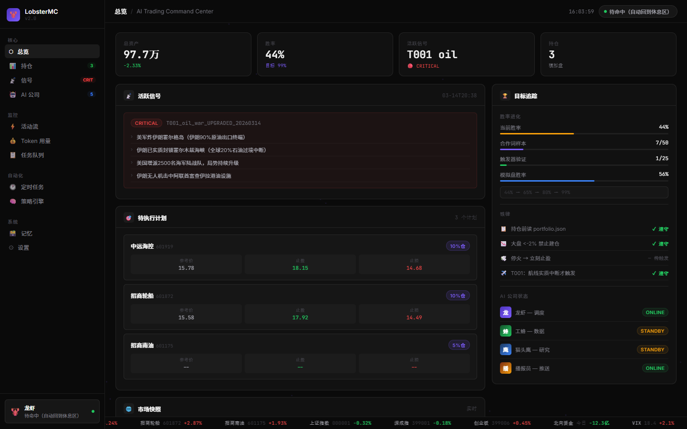
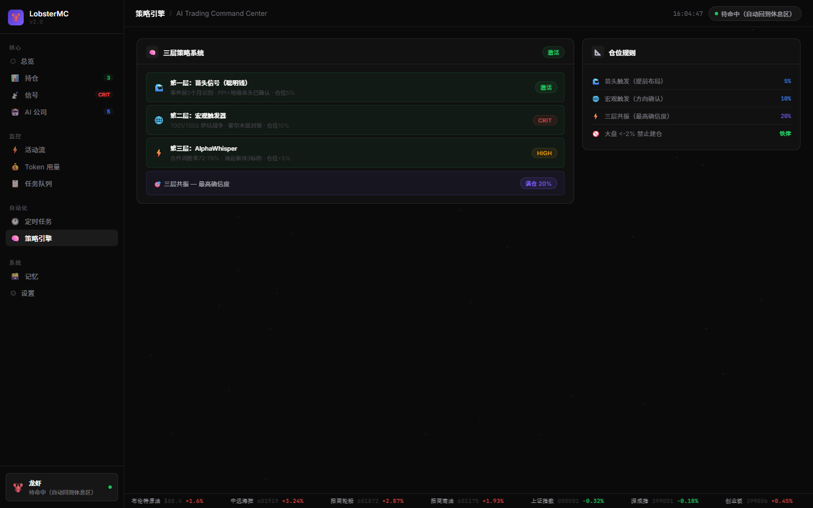

# 🦞 LobsterMC — AI Trading Command Center

> A mission control dashboard for AI trading agents. Built for quant traders who run their own AI company.



## What is this?

LobsterMC is a real-time command center that visualizes your AI trading team, live signals, portfolio positions, and automation schedules — all in one dark-mode dashboard.

It's built for people who:
- Run multiple AI agents for market research and trading
- Want a Bloomberg-style interface for their quant system
- Need to monitor signals, positions, and agent activity at a glance

## Features

- **📡 Live Signal Panel** — Critical/High severity signals with 3-layer resonance analysis
- **📊 Portfolio Tracking** — Real-time P&L, positions, cost basis, signal scores
- **🤖 AI Company** — Visualize your agent team (roles, models, online status)
- **🧠 Strategy Engine** — 3-layer system: Early Warning → Macro Trigger → AlphaWhisper
- **⚡ Activity Feed** — Real-time log of agent actions and decisions
- **🕐 Cron Monitor** — View and track all scheduled automation jobs
- **💰 Token Usage** — Cost breakdown by model and agent
- **📋 Task Queue** — Completed and pending task tracking
- **Bloomberg Ticker** — Live scrolling market data at the bottom

## Screenshots





## Stack

- **Frontend**: Pure HTML + CSS + Vanilla JS (single file, zero dependencies)
- **Backend**: Python Flask
- **Data**: Reads local JSON files (portfolio, signals, agent state)
- **Design**: Linear/Vercel-inspired dark UI, particle canvas background

## Quick Start

```bash
git clone https://github.com/1m1ai/LobsterMC
cd LobsterMC/backend
pip install flask
python server.py
# Open http://127.0.0.1:19001
```

## Architecture

```
LobsterMC/
├── frontend/
│   └── index.html          # Entire UI (single file)
├── backend/
│   └── server.py           # Flask API server (port 19001)
└── docs/
    └── preview.png
```

### API

The backend exposes one endpoint:

```
GET /api/status
```

Returns portfolio, active signals, execution plans, and agent state. Connect your own data sources by editing `server.py`.

## Data Sources

By default reads from:
- `paper_trading/portfolio.json` — positions and P&L
- `paper_trading/monday_plan.json` — signals and execution plans  
- `Star-Office-UI/state.json` — agent status

Swap these out for your own data pipeline.

## The 3-Layer Strategy System

```
Layer 1: Early Warning (Smart Money)
  → Identify signals 3 months before events
  → Entry at 5% position

Layer 2: Macro Trigger
  → 25 global trigger conditions
  → Entry at 10% position

Layer 3: AlphaWhisper
  → Intercept retail platform signals before the crowd
  → Cooperation keywords: 72~78% win rate

All 3 layers active → Full position (20%)
```

## Inspired By

- [mission-control](https://github.com/builderz-labs/mission-control) — great concept, we went further
- Bloomberg Terminal — the original trading UI
- Linear, Vercel — modern dark design language

## License

MIT

---

*Built by an AI trading team. For AI trading teams.*
