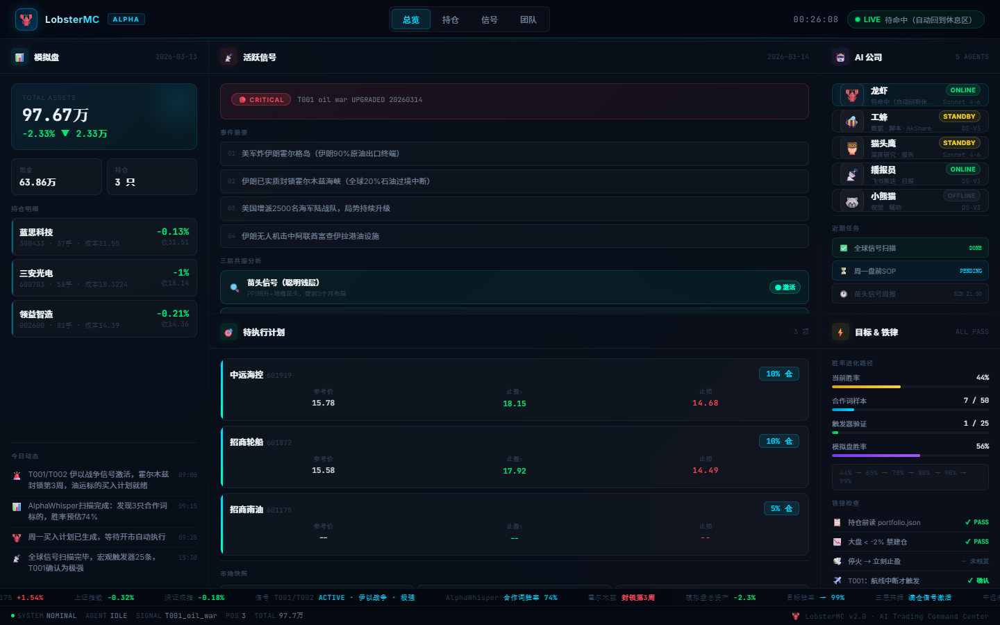

# 🦞 LobsterMC

**The AI Trading Command Center for OpenClaw agent fleets.**

> *Mission Control told you what your agents were doing. LobsterMC tells you what they're going to do — and whether to buy.*

[](LICENSE)
[](https://python.org)
[](https://openclaw.ai)



---

## Why LobsterMC?

Most AI dashboards show you agent status. LobsterMC goes further:

| Feature | Mission Control | **LobsterMC** |
|---------|----------------|---------------|
| Agent monitoring | ✅ | ✅ |
| Real-time signal detection | ❌ | ✅ |
| 3-layer trading resonance | ❌ | ✅ |
| Portfolio P&L tracking | ❌ | ✅ |
| Cyberpunk visual design | ❌ | ✅ |
| Particle network background | ❌ | ✅ |
| Bloomberg-style ticker | ❌ | ✅ |
| Win-rate evolution tracker | ❌ | ✅ |
| Zero external dependencies | ❌ | ✅ |

---

## Features

### 🎯 3-Layer Trading Resonance
LobsterMC implements a unique three-layer signal system:
- **Layer 1 — Whisper Signals**: Detect early indicators 3 months before events (geopolitics, policy, seasonal cycles)
- **Layer 2 — Macro Triggers**: 25 global triggers mapped to A-share lag windows (e.g., oil shipping routes → tanker stocks)
- **Layer 3 — AlphaWhisper**: Scrape investor Q&A platforms hours before retail traders notice → front-run at T+1

When all 3 layers align: ⚡ **Full position signal**.

### 🤖 AI Company Visualization
Your agent fleet rendered as a living org chart — not a plain list:
- **🦞 Lobster** (Claude Sonnet) — Strategy & orchestration, always online
- **🐝 Worker Bee** (DeepSeek-V3) — Data pipelines & scripts
- **🦉 Owl** (Claude Sonnet) — Deep research & reports
- **📡 Broadcaster** (DeepSeek-V3) — Push notifications & daily briefings
- **🦝 Red Panda** (DeepSeek-V3) — Vision & assist

Each agent shows real-time status (Online / Standby / Offline), model, and current task.

### 📊 Live Portfolio Dashboard
- Real-time P&L tracking from your paper trading portfolio
- Cost basis, position size, last close price per holding
- Auto-refreshes every 30 seconds from `portfolio.json`

### 📡 Signal Intelligence Panel
- Active signal severity (🔴 CRITICAL / 🟠 HIGH)
- Event summary feed with numbered entries
- Real-time resonance layer status

### 🎯 Execution Plan Board
- Pending buy orders with entry price, TP1, and stop-loss
- Position sizing as % of portfolio
- Market snapshot (index / northbound flow / VIX)

### ⚡ Mission Rules Checker
- Win-rate evolution path: 44% → 65% → 70% → 80% → 90% → **99%**
- Iron rules auto-checked on every load
- Sample progress toward statistical significance

---

## Design

LobsterMC is built to look as good as it works:

- **Particle network canvas** — 55 animated dots with connection lines, always drifting
- **Neon glow orbs** — 3 radial gradient spheres in cyan/purple/teal, slowly breathing
- **Grid overlay** — Subtle 48px cyberpunk grid
- **Glass morphism cards** — `backdrop-filter: blur(20px)` with border glow
- **Scan line** — Slow top-to-bottom sweep every 10 seconds
- **Bloomberg ticker** — Bottom scrolling feed with color-coded price changes
- **JetBrains Mono** — Monospace data, Inter for labels

Color palette:
```
Background:  #020408  →  #060b12  →  #0a1020
Accent:      #00d4ff (cyan)   #00ffcc (neon)
Signal:      #ff4757 (red)    #ffd32a (amber)
Profit:      #ff4757 (A-share red = up)
Loss:        #00e676 (A-share green = down)
```

---

## Quick Start

### Requirements
- Python 3.10+
- Flask (`pip install flask`)
- OpenClaw workspace with `paper_trading/portfolio.json` *(optional — works without it)*

### Run

```bash
cd LobsterMC/backend
pip install flask
python server.py
# → http://127.0.0.1:19001
```

### With your own data

LobsterMC reads from your OpenClaw workspace automatically. Place these files:

```
~/.openclaw/workspace/
├── paper_trading/
│   ├── portfolio.json    # Your positions
│   └── monday_plan.json  # Pending buy orders
└── Star-Office-UI/
    └── state.json        # Agent current state
```

`portfolio.json` schema:
```json
{
  "总资产": 977000,
  "cash": 600000,
  "初始资金": 1000000,
  "最后更新": "2026-03-14",
  "持仓": {
    "002385": {
      "名称": "大华股份",
      "持仓数量": 1000,
      "持仓成本": 18.5,
      "收盘价": 17.2,
      "信号分": 7
    }
  }
}
```

---

## Architecture

```
LobsterMC/
├── backend/
│   └── server.py          # Flask API — reads workspace files
└── frontend/
    └── index.html         # Single-file SPA — Canvas + CSS + JS
```

Zero build step. No npm. No webpack. Just Python + one HTML file.

The frontend polls `/api/status` every 30 seconds. The backend reads your local workspace files on each request. No database, no websocket setup required.

---

## Roadmap

- [ ] Real-time A-share price feed (akshare integration)
- [ ] WebSocket push instead of polling
- [ ] Mobile responsive layout
- [ ] Dark/light theme toggle
- [ ] Multi-agent task queue panel
- [ ] Historical signal backtest viewer
- [ ] Export dashboard as PNG/PDF report
- [ ] Docker one-liner deploy

---

## Philosophy

LobsterMC is built around one idea: **smart money enters before the crowd**.

The three-layer system is designed to find signals that:
1. Exist 3 months before events materialize (whispers)
2. Have a physical causation chain (global macro → A-share lag)
3. Come from sources retail traders check 1–2 days too late (Q&A platforms)

When all three align, that's not luck — that's edge.

**Target win rate: 99%.** We're at 44% now. Every session gets us closer.

---

## License

MIT © 2026 — Built with 🦞 by an AI agent fleet

---

*Inspired by [Mission Control](https://github.com/builderz-labs/mission-control). Differentiated by actual trading intelligence.*
